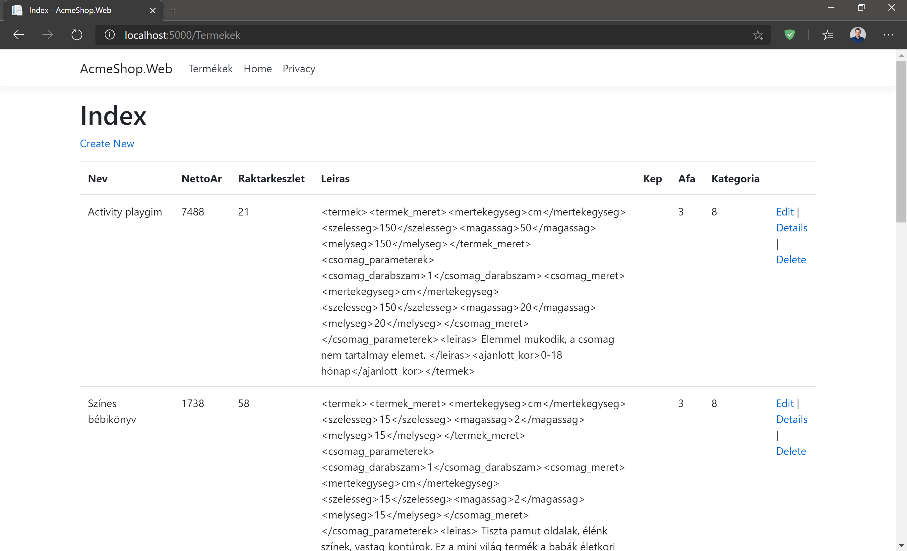
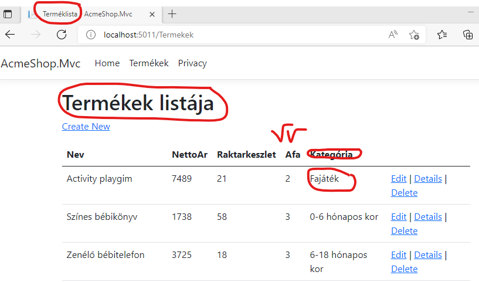

# ASP.NET Core MVC

## Célkitűzés

Egyszerű szerver oldalon renderelt felületek készítésének alapszintű elsajátítása ASP.NET Core technológia segítségével.

## Előfeltételek

A labor elvégzéséhez szükséges eszközök:

- Microsoft SQL Server (LocalDB vagy Express edition, Visual Studio telepítővel telepíthető)
- Visual Studio 2022 .NET 6 SDK-val telepítve

Amit érdemes átnézned:

- EF Core előadás anyaga
- ASP.NET Core Web API (kliens renderelt) előadás anyaga
- ASP.NET Core MVC, Razor Pages (szerver rendererelt) előadás anyaga
- A használt adatbázis [sémája](https://BMEVIAUBB04.github.io/gyakorlat-mssql/sema.html)

## Feladat 0: Kiinduló projekt letöltése, indítása

Az előző laborokon megszokott adatmodellt fogjuk használni MS SQL LocalDB segítségével. Az adatbázis sémájában néhány mező a .NET-ben ismeretes konvencióknak megfelelően átnevezésre került, felépítése viszont megegyezik a korábban megismertekkel.

1. Töltsük le a GitHub repository-t a reposiory főoldaláról (https://github.com/BMEVIAUBB04/gyakorlat-rest-web-api > *Code* gomb, majd *Download ZIP*) vagy a közvetlen [letöltő link](https://github.com/BMEVIAUBB04/gyakorlat-rest-web-api/archive/refs/heads/master.zip) segítségével. 
2. Csomagoljuk ki
3. Nyissuk meg a kicsomagolt mappa AcmeShop alkönyvtárban lévő solution fájlt.

A kiinduló solution egyelőre egy projektből áll:`AcmeShop.Data`: EF modellt, a hozzá tartozó kontextust (`AcmeShopContext`) tartalmazza. Hasonló az EF Core gyakorlaton generált kódhoz, de ez Code-First migrációt is tartalmaz (`Migrations` almappa).

## Feladat 1: Webes projekt elkészítése

1. Adjunk a solutionhöz egy új web projektet
    - Típusa: ASP.NET Core Web App (Model-View-Controller) (**nem Web Api!, nem sima Web App, fontos a zárójeles rész!**)
    - Neve: *AcmeShop.Mvc*
    - Framework: .NET 6.0
    - Authentication type: *None*
    - HTTPS, Docker: kikapcsolni

1. Függőségek felvétele az új projekthez
    - adjuk meg projektfüggőségként az `AcmeShop.Data`-t
    - adjuk hozzá a *Microsoft.EntityFrameworkCore.Design* NuGet csomagot

1. Adatbáziskapcsolat, EF beállítása
    - connection string beállítása a konfigurációs fájlban (appsettings.json). A nyitó `{` jel után
    ```javascript
     "ConnectionStrings": {
       "AcmeShopContext": "Data Source=(localdb)\\MSSQLLocalDB;Initial Catalog=AcmeShop"
     },
    ```
   - connection string kiolvasása a konfigurációból, `AcmeShopContext` példány konfigurálása ezen connection string alapján, `AcmeShopContext` példány regisztrálása DI konténerbe. Program.cs-be, a `builder.Build()` sor elé:
    ```csharp
    builder.Services.AddDbContext<AcmeShopContext>(
        options => options.UseSqlServer(
            builder.Configuration.GetConnectionString(nameof(AcmeShopContext))));
    ```

1. Ha van már adatbázis _AcmeShop_ néven, töröljük le.
1. Fordítsuk a solutiont.
1. Adatbázis inicializálása Package Manager Console (PMC)-ban
   - Indítandó projekt az `AcmeShop.Mvc` projekt legyen (jobbklikk az AcmeShop.Mvc-n > *Set as Startup Project*)
   - A PMC-ben a Defult projekt viszont az `AcmeShop.Data` legyen
   - PMC-ből generáltassuk az adatbázist az alábbi paranccsal
    ```powershell
    Update-Database
    ```

1. Projekt indítása. Próbáljuk ki a jelenleg elérhető oldalakat.

## Feladat 2: Adatbázis objektumok lekérdezése és megjelenítése

Az eddig legenerált MVC oldalak nem használták az adatbázisunkat. Vegyünk fel új kontrollereket és nézeteket, melyek segítségével le tudjuk kérdezni az adatbázist (a kontroller feladata) és az eredményt HTML-be tudjuk formázni (ez a nézetek feladata)! A leggyorsabb módja ennek a kódgenerálás (scaffolding).

1. Adjunk hozzá az MVC projekthez a *Microsoft.VisualStudio.Web.CodeGeneration.Design* NuGet csomagot.
1. Az AcmeShopContext.cs alján (_Data projekt_) kommentezzük vissza az `AcmeShopContextFactory` osztályt. (Erre nem kellene szükség legyen, valószínűleg a generátorban lévő bug miatt kell mégis.)
1. Fordítsuk az MVC projektet.
1. PMC-ben telepítsük az ASP.NET Core kódgeneráló eszközt, ha még korábban nem telepítettük az adott gépen
    ```powershell
    dotnet tool install -g dotnet-aspnet-codegenerator
    ```
1. Lépjünk be a projekt könyvtárába
    ```powershell
    cd .\AcmeShop.Mvc
    ```
1. Generáljunk a kódgenerálóval kontrollert és kapcsolódó nézeteket a `Termek` entitáshoz (`-m`), mely a `AcmeShopContext` kontextushoz  (`-dc`) tartozik. A generált kontroller neve legyen `TermekController` (`-name`), az `AcmeShop.Mvc.Controllers` névtérbe  (`-namespace`) kerüljön. A generált fájl a *Controllers* mappába (`-outDir`) kerüljön. A generált nézetek használják az alapértelmezett (projektben már meglévő) layoutot (`-udl`).
    ```powershell
    dotnet aspnet-codegenerator controller -m AcmeShop.Data.Termek -dc AcmeShop.Data.AcmeShopContext -outDir Controllers -name TermekekController -namespace AcmeShop.Mvc.Controllers -udl
    ```
1. Kommentezzük ki az `AcmeShopContextFactory` osztályt.
1. Vegyünk fel egy új navigációs lehetőséget a Views\Shared\_Layout.cshtml-be. Másoljuk le a _Home_ menüpontot reprezentáló `<li>` címkét saját maga alá és írjuk át az `asp-controller` értékét az `<a>` gyerekcímkében `Termekek`-re és az `<a>` címkék közötti szöveget is a kívánt menüpont névre, pl. _Termékek_. A teljes `<li>` valami az alábbihoz hasonló lesz:
``` HTML
<li class="nav-item">
    <a class="nav-link text-dark" asp-area="" asp-controller="Termekek" asp-action="Index">Termékek</a>
</li>
```

Vegyük észre, hogy nem állítottuk be az `<a>` elem `href` tulajdonságát, helyette az [`asp-page` TagHelper](https://docs.microsoft.com/en-US/aspnet/core/mvc/views/tag-helpers/intro)t használtuk, ami a kontroller és a kontrolleren belüli művelet neve alapján az az URL-t fogja nekünk generálni az elkészülő HTML-be, amit böngészőben navigálva a megadott action hívódik meg.

Teszteljük az így létrejött alkalmazást, teszteljük a termékekkel kapcsolatos funkciókat! A tesztelt oldalak forráskódját is tekintsük át (a kontrollert és a nézeteket és is)!



A legtöbb funkció alapvetően működőképes, de lehet találni hibákat, kényelmetlenségeket. Például:
- A törlés általában csak akkor működik, ha általunk felvett termékről van szó (például a _Create New_ link segítségével). A legtöbb alapból felvett terméknek ugyanis van már valamilyen érintettsége idegen kulcs kényszerben.
- A kapcsolódó elemeknek (kategória, áfakulcs) csak az azonosítójukkal szerepelnek, ez elég kényelmetlenné tesz minden funkciót ahol megjelennek - pl. nem tudjuk melyik kategóriát jelentik az egyes azonosítók.

## Feladat 3: Listázó nézet szépítése

A _Views/Termekek/Index.cshtml_ felelős a termékek listájának megjelenítéséért. A `TermekekController.Index` ugyan nem adja meg, hogy ez a nézet legyen a szerencsés, de a nézet felderítés algoritmusa (_Views/[Kontroller név]/[Függvény név]_) ezt jelöli ki.

Vizsgáljuk meg ezen nézet kódját és végezzük el az alábbi módosításokat.

1. Írjuk át az oldal címét (HTML `<title>` címke). Ez a böngésző címsorában vagy a böngészőfülön megjelenő felirat. Ezt MVC-ben általában nem a nézet írja ki közvetlenül (`<title>` tag-et használva), hanem valamelyik layout nézet. Esetünkben konkrétan a Views/Shared/_Layout.cshtml. Figyeljük meg ez utóbbi nézet kódjában a `<title>@ViewData["Title"] - AcmeShop.Mvc</title>` sort. Ebből látható, hogy a ViewData szótárban a `Title` kulcshoz tartozó érték kerül a `<title>` címkébe. Szerencsére ezt az értéket az _Index.cshtml_-ben is állít(hat)juk. A nézet tetején írjuk át a vonatkozó C# blokkban a beállított értéket.

    ```razor
    @{
        ViewData["Title"] = "Terméklista";
    }
    ```

1. Rögtön ezalatt egy `<h1>` címke található, ami az oldal címsorát adja. Ezt is írjuk át, pl.

    ```html
    <h1>Termékek listája</h1>
    ```

1. Ez a nézet ne jelenítse meg a képet és a leírást. Töröljük/kommentezzük ki (`@*...*@`) HTML táblázat fejlécéből és törzséből is.

    ```razor
    @*<th>
        @Html.DisplayNameFor(model => model.Leiras)
    </th>
    <th>
        @Html.DisplayNameFor(model => model.Kep)
    </th>*@
    ```

    ```razor
    @*<td>
        @Html.DisplayFor(modelItem => item.Leiras)
      </td>
      <td>
        @Html.DisplayFor(modelItem => item.Kep)
      </td>*@
    ```
    
1. A táblázatban a fejléc feliratok egy az egyben a property-k nevei, ami felhasználói szemmel elég ronda. Ezen feliratokat a `DisplayNameFor` HTML helper generálja. Ez a helper alapvetően csak utolsó lehetőségként használja a property nevét, előnyben részesíti a property-re tett `Display` attribútumot (a `System.ComponentModel.DataAnnotations` névtérből). Tegyük fel ezen attribútumot első körben a `Kategoria` property-re (a _Data_ projekt `Termek` osztályában).

    ```csharp
    [Display(Name = "Kategória")]
    public Kategoria? Kategoria { get; set; }
    ```

    Éles felhasználásra készülő projektekben gyakran inkább resource fájlokba szervezzük a feliratszövegeket és [onnan hivatkozzuk](https://docs.microsoft.com/en-us/aspnet/core/fundamentals/localization?view=aspnetcore-6.0#dataannotations-localization), mert úgy könnyebb a többnyelvűsítés.

1. A kapcsolódó elemekből (áfakulcs, kategória) a táblázatban csak az azonosítók szerepelnek. A megjelenítendő propertyt a `DisplayFor` HTML helper jelöli ki. Írjuk át a kategória megjelenítéséért felelős `DisplayFor` hívást, hogy az azonosító helyett a nevet használja.

    ```razor
    @*@Html.DisplayFor(modelItem => item.Kategoria.Id)*@
    @Html.DisplayFor(modelItem => item.Kategoria.Nev)
    ```

1. Próbáljuk ki a változásokat, ellenőrizzük, hogy a következők megváltoztak-e:
- oldal címe
- oldal címsora
- leírás, kép oszlopok
- kategória oszlop fejléce
- kategória oszlop értéke



Bónuszként láthatjuk, hogy a termék részletes oldalon (_Details_ link) is a kategória neve megváltozott, mert ugyanazon `Display` attribútumot használja a HTML helper (`@Html.DisplayNameFor(model => model.Kategoria)`).

## Feladat 4: Termék létrehozási folyamat továbbfejlesztése

A termékek szerkesztő és létrehozás (Edit, Create) oldalain láthatjuk, hogy a generált kódunk felismerte a kapcsolódó entitásokat is, amiket legördülő listából választhatunk ki. Ez nagyon jó, de az azonosító alapján nehezen tudjuk megmondani a helyes termékkategóriát és ÁFA-kulcsot, így helyesebb volna a nevüket megjeleníteni a felületen.

1. Vizsgáljuk meg az új termék létrehozásához tartozó műveletet. Igazából két műveletről van szó, a `Create()` művelet a **/Termekek/Create** címre navigáláskor hívódik meg, míg a másik `HttpPost` attribútummal ellátott változat ugyanezen címre egy űrlapot visszaküldenek. (HTML űrlapok visszaküldése tipikusan HTTP POST üzenettel történik). Az előbbi művelet felelős a létrehozó űrlap megjelenítéséért: feltölt néhány `ViewData` adatot, a többi a nézet (_Views/Termekek/Create.cshtml_) feladata. A `ViewData`-ba minden kapcsolódó elemhez egy-egy `SelectList` kerül. A `SelectList` a legördülő menükhöz használható modellként, összefogja a legördülő menühöz kapcsolódó listát, hogy a listaelemtípus melyik propertyjét kell használni feliratként, illetve elemazonosítóként. Pont a feliratot szeretnénk állítani, ezért módosítsuk a kategóriához létrehozott `SelectList`-et:

    ```csharp
    ViewData["KategoriaId"] = new SelectList(_context.Kategoria, nameof(Kategoria.Id), nameof(Kategoria.Nev));
    ```

1. A kapcsolódó nézetből (_Views/Termekek/Create.cshtml_) töröljük/kommentezzük ki a leírás és a kép propertykhez generált részeket.

    ```razor
    @*<div class="form-group">
        <label asp-for="Leirasclass="control-label"></label>
        <input asp-for="Leirasclass="form-control" />
        <span asp-validation-for="Leirasclass="text-danger"></span>
    </div>
    <div class="form-group">
        <label asp-for="Kepclass="control-label"></label>
        <input asp-for="Kepclass="form-control" />
        <span asp-validation-for="Kepclass="text-danger"></span>
    </div>*@
    ```

1. A másik (POST-os) `Create` műveletben a paraméter `Bind` attribútummal van ellátva. Ebben azt a lehető legszűkebb tulajdonsághalmazt érdemes megadni, ami a művelet elvégzéséhez kell. Ez amiatt kell, hogy vicces kedvű vagy támadó szándékú kolléga ne tudjon olyan HTTP POST kérést készíteni, amiben olyan tulajdonságokat is kitölt, amiket nem akarunk a HTTP kérésben érkező adatok alapján tölteni. Innen is érdemes kivenni a kép és leírás tulajdonságokat, hiszen ezeket már eleve meg se lehet adni az űrlapon.

    ```csharp
    public async Task<IActionResult> Create([Bind("Id,Nev,  NettoAr,Raktarkeszlet,AfaId,KategoriaId")] Termek termek)
    ```

1. Tegyünk töréspontot mindkét `Create` műveletre.

1. Debug módban indítva a projektet új termék felvételével próbáljuk ki, hogy a kategória legördülő menü jól működik-e. Kövessük végig a folyamatot debuggerrel ([**F10**] gombbal léptetve).

## Feladat 5: Validáció

Az adatbázisban a termék neve legfeljebb 50 karakter hosszú lehet. Bár az adatbázis nem kényszeríti ki, az ár és a raktárkészlet esetében csak pozitív (vagy nulla) értékeknek van létjogosultsága. Érvényesítsük ezeket a validációs szabályokat!

1. A `Termek` típus (_Data_ projekt) vonatkozó property-jeire helyezzünk el [modell validációs attribútumokat](https://docs.microsoft.com/en-us/aspnet/core/mvc/models/validation?view=aspnetcore-6.0#built-in-attributes).
    
    ```csharp
    [MaxLength(50)]
    public string? Nev { get; set; }

    [Range(0, double.MaxValue, ErrorMessage = "A termék ára nem lehet negatív")]
    public double? NettoAr { get; set; }

    [Range(0, int.MaxValue, ErrorMessage = "A termék raktárkészlete nem lehet negatív")]
    public int? Raktarkeszlet { get; set; }
    ```

    Az EF ugyan eddig is tudta, hogy a név maximum 50 hosszú lehet, a kontext `OnModelCreating` függvényében van leírva, de ezt az ASP.NET Core MVC nem veszi figyelembe, csak bizonyos C# attribútumokat. Ha ez zavar minket, érdemes a kliens renderelt esethez hasonlóan külön modell réteget létrehozni az ASP.NET Core számára, így az EF és az MVC modell beállításai nem keverednek.

2. Próbáljuk ki a validációt valamelyik termék szerkesztésével. Az oldal HTML forrásában ellenőrizhetjük, hogy a maximális szöveghosszt a HTML `input` mezőre tett [`maxlength`](https://developer.mozilla.org/en-US/docs/Web/HTML/Attributes/maxlength) attribútummal oldotta meg az ASP.NET Core. A raktárkészlet és az ár ellenőrzése viszont csak a mentés gomb hatására szerveroldalon történik meg. Ezt is ellenőrizhetjük, ha a HTTP POST kérésre reagáló `Edit` kontrollerműveletre teszünk töréspontot. A művelet kódjában látható, hogy az ellenőrzés eredményét a `ModelState.IsValid` property lekérdezésével kapjuk meg.

3. A legtöbb ellenőrzés annyira egyszerű, hogy  böngészőben futó JavaScript kóddal is ellenőrizhető, a szerverhez fordulni ezért felesleges. Az ASP.NET Core számos beépített validációs attribútumhoz legenerálja a kliensoldali ellenőrzéshez szükséges kódot, HTML attribútumokat. Az ellenőrzést a böngészőben a [jQuery űrlap validációs könyvtár](https://github.com/jquery-validation/jquery-validation) végzi. Azon nézetekben, ahol kliensoldali validációt akarunk használni ezt a JavaScript könyvtárat hivatkozni kell. A hivatkozások már meg vannak írva a _Views/Shared/__ValidationScriptsPartial.cshtml_ nézetfájlban. A layout nézetünk másrészről eleve definiál egy helyet (section) ahová a nézeteknek ezeket a hivatkozásokat elhelyezni érdemes. A _Views/Shared/__Layout.cshtml_ végén látható a szekció definííciója:
    
    ```razor
    @await RenderSectionAsync("Scripts", required: false)
    ```

    Így nincs is más dolgunk, mint a nézetünkben (Edit.cshtml) kitöltsük a _Scripts_ nevű szekciót a __ValidationScriptsPartial.cshtml_ tartalmával. A nézet végére:

    ```razor
    @section Scripts {
        @{await Html.RenderPartialAsync ("_ValidationScriptsPartial"); }
    }
    ```

1. Próbáljuk ki újra a szerkesztést. Így már az adott érték (ár, raktárkészlet) szerkesztése után, ha a szövegmező elveszti a fókuszt, de még a mentés gomb megnyomása előtt is kapunk visszajelzést, ha nem megfelelő a bevitt érték. Törésponttal ellenőrizhetjük, hogy a mentés gomb nyomogatása nem okoz szerver hívást, ha nem megfelelő a bevitt érték.

# Önálló feladatok

## Feladat 1: Nézetek szépítése

### Listázó nézet (Index.cshtml)

Cseréld le a műveletek linkfeliratát emoji-kra. Az emojikat [HTML entitásokként](https://developer.mozilla.org/en-US/docs/Glossary/Entity) adjuk meg. Ahhoz, hogy az emoji ne legyen aláhúzva (ami szövegeknél jól mutat, képeknél nem annyira) a [text-decoration-none](https://getbootstrap.com/docs/5.0/utilities/text/#text-decoration) CSS osztályt alkalmazhatjuk. Az alábbi példa az _Edit_ művelethez tartozó linkre alkalmazza a fentieket, és egy [ceruza emojit](https://unicode-table.com/en/270F/) használ feliratként.

```html
<a asp-action="Edit" asp-route-id="@item.Id" class="text-decoration-none">&#9999;</a>
```

További műveletekhez használható emoji-k. A HTML entitás kódját nézzük meg a linkelt dokumentációban:
- Új (Create) - [+](https://unicode-table.com/en/2795/)
- Részletek (Details) - [Memó](https://unicode-table.com/en/1F4DD/)
- Törlés (Delete) - [X](https://unicode-table.com/en/274C/)


### Készítő nézet (Create.cshtml)

A korábbi feladatok alapján módosítsuk az oldalt az alábbiak szerint.

- Oldal címe (HTML `title`): Termékfelvétel
- Címsor (HTML `h1`): Új termék
- Alcímsor (HTML `h4`): Termék
- Létrehozás gomb felirat (HTML input submit): Új
- Vissza a listázó oldalra link (Index művelet): [ 	
<-](https://unicode-table.com/en/1F519/) emoji


### Törlés nézet (Delete.cshtml)

A korábbi feladatok alapján módosítsuk az oldalt az alábbiak szerint.

- Oldal címe (HTML `title`): Terméktörlés
- Címsor (HTML `h1`): Termék törlése
- Alcímsor (HTML `h3`): Biztosan törli?
- Alcímsor2 (HTML `h4`): Termék
- Kép és leírás propertykhez tartozó részek törlése/kommentezése (2 db. `<dt>`-`<dd>` pár)
- Vissza a listázó oldalra link (Index művelet): [ 	
<-](https://unicode-table.com/en/1F519/) emoji
- Törlés gomb felirat (HTML input submit): Törlés


### Részletes nézet (Details.cshtml)

A korábbi feladatok alapján módosítsuk az oldalt az alábbiak szerint.

- Oldal címe (HTML `title`): Termékadatok
- Címsor (HTML `h1`): Termék részletek
- Alcímsor2 (HTML `h4`): Termék
- Kép és leírás propertykhez tartozó részek törlése/kommentezése (2 db. `<dt>`-`<dd>` pár)
- Vissza a listázó oldalra link (Index művelet): [ 	
<-](https://unicode-table.com/en/1F519/) emoji
- Szerkesztő oldalra link (Edit művelet): [ceruza](https://unicode-table.com/en/270F/) emoji

### Szerkesztés nézet (Edit.cshtml)

A korábbi feladatok alapján módosítsuk az oldalt az alábbiak szerint.

- Oldal címe (HTML `title`): Termék módosítás
- Címsor (HTML `h1`): Termék módosítás
- Alcímsor (HTML `h4`): Termék
- Kép és leírás propertykhez tartozó részek törlése/kommentezése (2 db. `<div class="form-group">` rész)
- Mentés gomb felirat (HTML input submit): Mentés
- Vissza a listázó oldalra link (Index művelet): [ 	
<-](https://unicode-table.com/en/1F519/) emoji


## Feladat 2: Feliratok megadása modellattribútumokkal

A korábbi feladatok alapján a `Display` C# attribútum módosítsuk az alábbi property-k nevének megjelenítését.

- `Nev` -> Név
- `NettoAr` -> Nettó ár
- `Raktarkeszlet` -> Raktárkészlet
- `Afa` -> Áfakulcs

## Feladat 3: Áfakulcs megjelenítése

A korábbi feladatok alapján a termék listázó oldalon (Index.cshtml) a termékhez kapcsolódó `Afa` példány azonosítója (`Id`) helyett az áfakulcs értékét írjuk ki.

## Feladat 4: Törlés biztonságosabbá tétele

A törlés funkció általában hibára fut, mert a termék idegen kulcs kényszerben érintett és alapesetben ilyenkor a terméket nem engedi törölni az adatbázis.

A törlés funkció adatkezelő alkalmazásokban egy erősen átgondolandó művelet, sok féle hozzáállás lehetséges, a megrendelői igényektől és a komplexitástól is függ, hogy melyik irány a legmegfelelőbb. Néhány lehetséges irány:

- (bizonyos) idegen kulcs kényszerek átállítása, hogy az adatbázis engedje a [kaszkád törlést](https://docs.microsoft.com/en-us/ef/core/saving/cascade-delete)
- [logikai törlés](https://www.thereformedprogrammer.net/ef-core-in-depth-soft-deleting-data-with-global-query-filters/) (_soft delete_) - igazi törlés helyett csak egy oszlop értékének átállításával jelezzük, hogy az adott rekordot törölték
- korlátozni a törlést csak függőséggel nem rendelkező elemekre

Most az utóbbi irányt kövesd: a törlés jóváhagyó oldalra (Delete.cshtml a kapcsolódó nézet) navigáláskor vizsgáld meg, hogy az adott terméknek van-e függősége. Ezt is többféleképp lehet megtenni. EF lekérdezéssel meg lehet nézni minden olyan kapcsolatot, amiben `Termek` entitás érintett. Másik lehetőség, hogy egy nem commitolódó tranzakcióban töröljük a terméket. Ha nem keletkezik kivétel, engedjük az igazi törlést. Egyik módszer sem 100%-os, mert a törlés engedélyezése és a törlés gomb megnyomása között megváltozhat a helyzet, például egy másik felhasználó függőséget létrehozó műveletet végezhet.

A megoldás vázlata:

1. A törlést jóváhagyó oldalra (műveletre) navigáláskor a kontrollerműveletben már most is van pár ellenőrzés (azonosító meg van-e adva, az adott azonosítóval van-e termék). Ezen meglévő ellenőrzések után valósítsd meg a törlést előellenőrző logikát. Az alábbi kódrészlet segítség a tranzakciós módszerhez:

    ```csharp
    try
    {
        using var tr = await _context.Database. BeginTransactionAsync();
        _context.Termek.Remove(termek);
        await _context.SaveChangesAsync();
        tr.Rollback();
    }
    catch(DbUpdateException)
    {
        
    }
    ```
    A fenti kódrészletben ha a `catch` ágba akkor jut a végrehajtás, akkor a terméket nem szabad törölni. A tranzakció sosem fog commitolni, akkor sem, ha kivétel keletkezik.

1. Ha az ellenőrzés alapján nem törölhető a termék, adj át a nézetnek erről egy hibaszöveget.

1. A kapcsolódó nézetben, ha a hibaszöveg be van állítva, jelenítsd meg a szöveget egy [figyelmeztető sávban](https://getbootstrap.com/docs/5.0/components/alerts/).

1. Ugyanezen nézeten a tényleges törlést elvégző gombot [tiltsd le](https://developer.mozilla.org/en-US/docs/Web/HTML/Attributes/disabled), ha a hibaszöveg be van állítva. A letiltáshoz elég a `disabled` HTML attribútumot generálni érték nélkül. Segítségképp alább egy példa az attribútum felhelyezésére:

    ```razor
    <input type="submit" value="Felirat" @(feltetel ? "disabled" : "")/>
    ```
    A `feltetel` helyére egy logikai kifejezést kell behelyettesíteni, ami akkor igaz, ha a gombot le kell tiltani.

## Feladat 5: Legördülő menük felhasználóbarátabbá tétele

A korábbi feladatok alapján a kontrollerben lévő minden _SelectList_ konstruktorhívást módosítsd, hogy a legörülő menük felhasználóbarátabbak legyenek. Az áfa azonosító helyett a felirat az áfakulcs legyen, kategória azonosító helyett pedig a kategória neve. Csak a `string` konstans (macskakörmös) paramétereket kell módosítani. `string` konstans (macskaköröm) helyett használj `nameof` operátort.

---

Az itt található oktatási segédanyagok a BMEVIAUBB04 tárgy hallgatóinak készültek. Az anyagok oly módú felhasználása, amely a tárgy oktatásához nem szorosan kapcsolódik, csak a szerző(k) és a forrás megjelölésével történhet.

Az anyagok a tárgy keretében oktatott kontextusban értelmezhetőek. Az anyagokért egyéb felhasználás esetén a szerző(k) felelősséget nem vállalnak.
