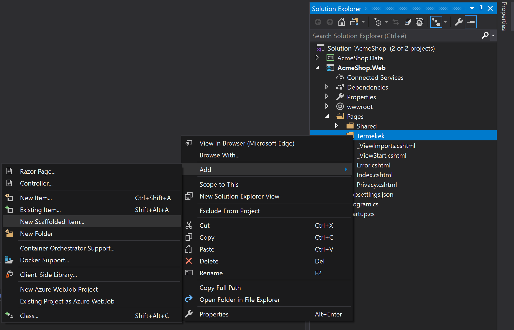
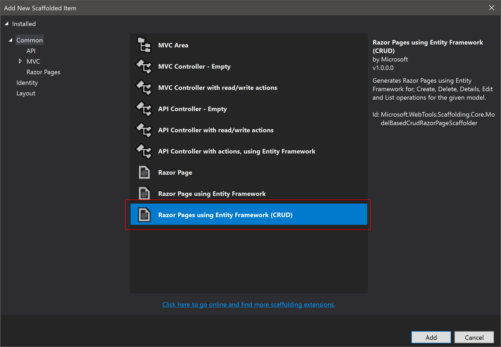
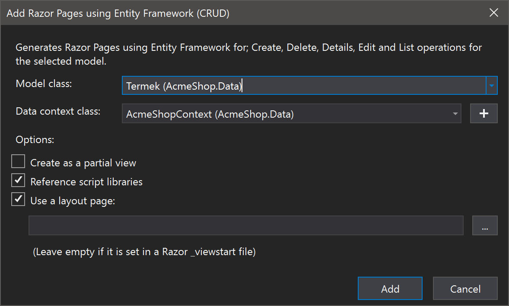
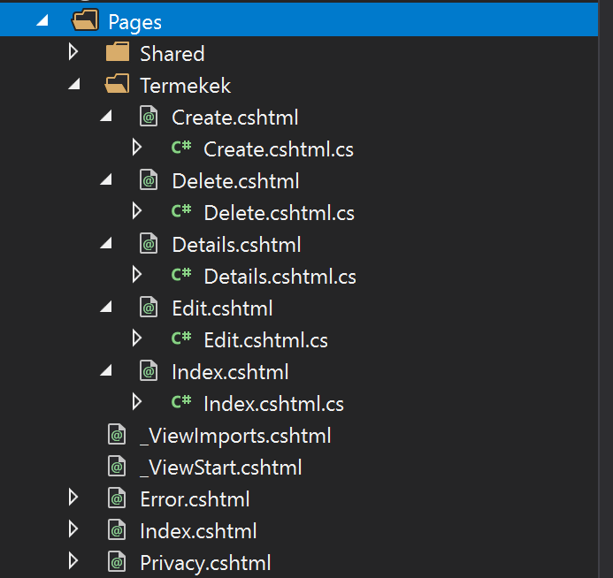
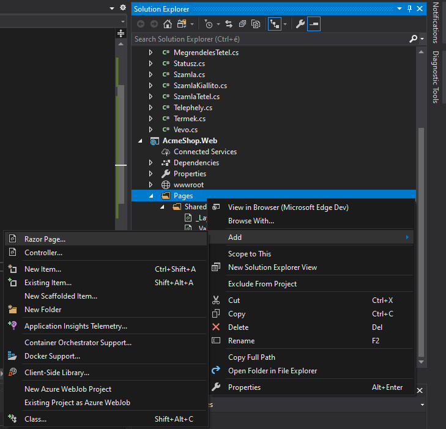
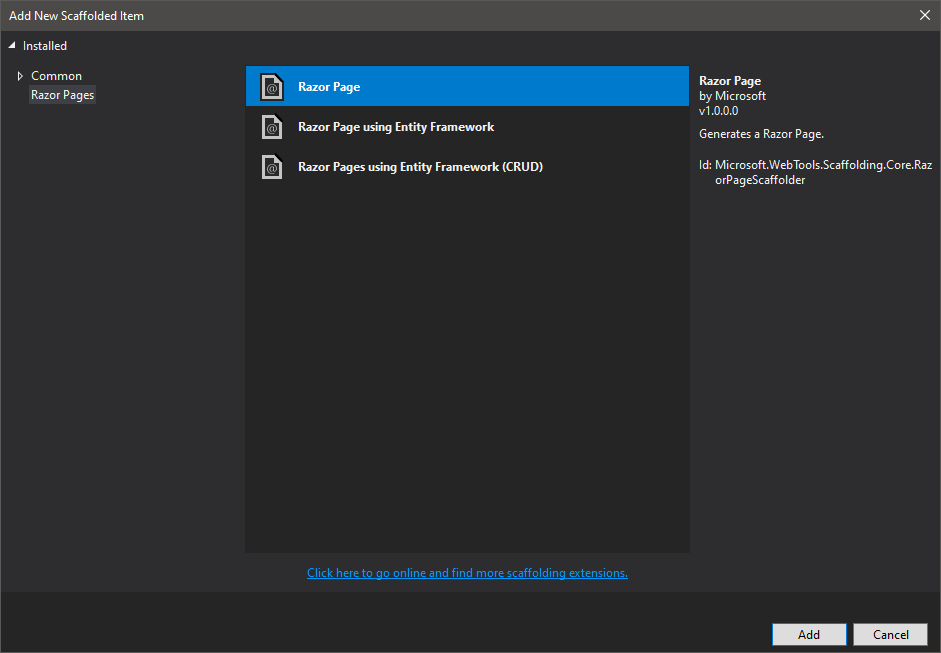
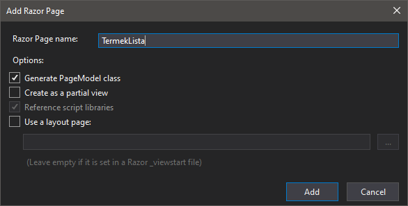
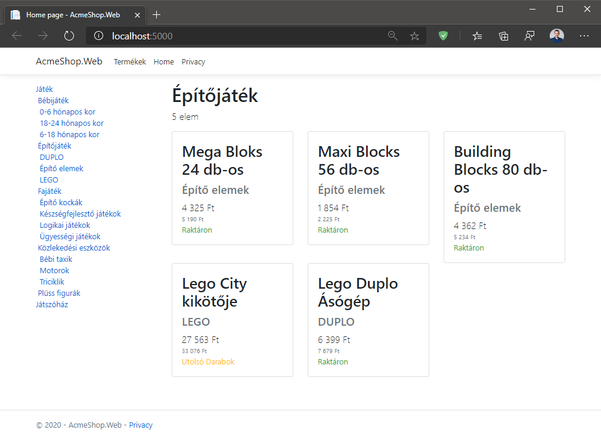
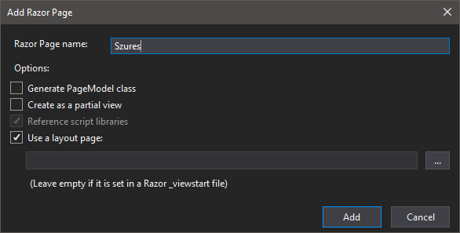

# ASP.NET Core Razor Pages, Web API

## Célkitűzés

Szerver oldali renderelés készítésének alapszintű elsajátítása kiegészítő REST-jellegű webszolgáltatásokkal.

## Előfeltételek

A labor elvégzéséhez szükséges eszközök:

- Microsoft SQL Server (LocalDB vagy Express edition, Visual Studio telepítővel telepíthető)
- Visual Studio 2019 .NET 5 SDK-val telepítve

Amit érdemes átnézned:

- EF Core előadás anyaga
- ASP.NET Core előadások anyaga (Web API, MVC, Razor Pages)
- A használt adatbázis [sémája](https://BMEVIAUBB04.github.io/gyakorlat-mssql/sema.html)

## Gyakorlat menete

A gyakorlatok laborvezetővel közösen és önállóan is elvégezhetők jelen útmutató segítségével. A feladatok megoldásai megtalálhatók az útmutatóban, rövid magyarázattal.

## Feladat 0: Kiinduló projekt letöltése, indítása

Megjegyzés: a kiinduló projekt felépítése, a benne történt módosítások analógak az ASP.NET Razor Pages és az ASP.NET Web API laborok között.

Az előző laborokon megszokott adatmodellt fogjuk használni MS SQL LocalDB segítségével, de egy másik elérési útvonalon, hogy tiszta adatbázissal induljunk. Az adatbázis sémájában néhány mező a .NET-ben ismeretes konvencióknak megfelelően átnevezésre került, felépítése viszont megegyezik a korábban megismertekkel.

1. Nyissuk meg a Visual Studio-t, és a megnyíló nyitóképernyőn válasszuk a "Clone or check out code" lehetőséget, és adjuk meg jelen repository git URL-jét és egy megfelelő (otthoni munkavégzés esetén tetszőleges) munkamappát: `https://github.com/BMEVIAUBB04/gyakorlat-server-side-rendering.git`
2. A klónozást a Visual Studio el fogja végezni nekünk, megnyitja a repository mappáját. Duplaklikkeljünk a megjelenő Solution Explorer ablakban az `AcmeShop\AcmeShop.sln` fájlra, ami megnyitja a kiinduló projektünket.

A kiinduló solution 2 projektből áll:
- `AcmeShop.Data`: az `AcmeShopContext`-et, a hozzá kapcsolódó entitásokat és a kiinduló migrációt tartalmazó projekt,
- `AcmeShop.Web`: a szokásos ASP.NET Core kiinduló Razor Pages projekt, amiben az alábbi bővítések történtek:
  - A projekt referálja az `AcmeShop.Data` projektet.
  - Az alkalmazás DI konténerébe regisztrálásra került az `AcmeShopContext` a `Startup` osztály `ConfigureServices` metódusában az alábbi módon:
  ``` C#
  public void ConfigureServices(IServiceCollection services)
  {
      services.AddDbContext<AcmeShopContext>(options => options.UseSqlServer(Configuration.GetConnectionString(nameof(AcmeShopContext))));
  // ...
  ```
  - Az adatbázis connection stringje bekerült az `appsettings.json`-be, az `appsettings.Development.json` törlésre került.
  - A projekt induláskor (`Program.Main` metódus) a szokásos kiszolgáló felépítésén túl az adatbázis automatikus létrehozását/migrációját is elvégzi, így az első indításkor létre fog jönni az adatbázisunk (további migrációk esetén azokat indításkor alkalmazza az adatbázison, inkompatibilis migrációk esetén pedig újra létrehozza az adatbázist).
  - A `Properties\launchSettings.json` fájlból eltávolításra került az IIS Expresstől való függőség, így az alkalmazás indításakor csak a Kestrel szerver fog futni egy konzolalkalmazás formájában.
3. Indítsuk el a projektet az `F5` megnyomásával! Ez első alkalommal tovább tarthat, ilyenkor ugyanis a teljes alkalmazás fordítása és az adatbázis létrehozása történik.

**Figyelem!** A szerveroldali kód módosítása során (néhány kivételtől eltekintve) szükséges újraindítani a szervert, hogy a változtatások érvényesüljenek.

## Feladat 1: Termékek generált oldalai

A Visual Studio beépített lehetőségeinek segítségével generáljuk le a termékek listázó, részletező, szerkesztő, törlésre szánt oldalait!
- Hozzunk létre egy új mappát a Pages-en belül `Termekek` néven!
- `Pages\Termekek` mappa -> Jobb klikk -> Add -> New Scaffolded Item...<br>

  - Ha a lehetőség nem jelenik meg, fordítsuk le előbb az alkalmazást!
- Válasszuk az ábrán látható lehetőséget (Razor Pages using Entity Framework (CRUD))<br>

- Végül válasszuk a `Termek` entitást és a hozzá tartozó `AcmeShopContext` adatbázis-kontextust!

- Az esetleg hosszas művelet eredményeképp 5 új Razor Page-ünk jön létre a CRUD műveletekre.<br>


Vegyünk fel egy navigációs lehetőséget a Pages\Shared\_Layout.cshtml-be, a 21. sorba:
``` HTML
<li class="nav-item">
      <a class="nav-link text-dark" asp-page="/Termekek/Index">Termékek</a>
</li>
```

Vegyük észre, hogy nem állítottuk be az `<a>` elem `href` tulajdonságát, helyette az [`asp-page` TagHelper](https://docs.microsoft.com/en-US/aspnet/core/mvc/views/tag-helpers/intro?view=aspnetcore-3.1)t használtuk, ami a Page neve alapján a megfelelő URL-t fogja nekünk generálni az elkészülő HTML-be! Ezzel a Page-ünket azonosítjuk az alkalmazásban, ami alapján a keretrendszer visszakeresi a megfelelő URL-t (esetünkben a /`Termekek/Index` Page-ből a `/Termekek` URL jön létre).

Teszteljük az így létrejött alkalmazást, teszteljük a termékekkel kapcsolatos funkciókat! A tesztelt oldalak forráskódját is tekintsük át (a nézet és code behind oldalakat is)!


## Feladat 2: Termék szerkesztés és létrehozás szépítése

A termékek szerkesztő és létrehozás (Edit, Create) oldalain láthatjuk, hogy a generált kódunk felismerte a kapcsolódó entitásokat is, amiket legördülő listából választhatunk ki. Ez nagyon jó, de az ID alapján nehezen tudjuk megmondani a helyes termékkategóriát és ÁFA-kulcsot, így helyesebb volna a nevüket megjeleníteni a felületen.

Ezen felül a címkék sem kifejezetten beszédesek, ugyanis az AfaId mező valójában az ÁFA-kulcs megadására szolgál (természetesen mi a külső kulcsot, nem a konkrét ÁFA-kulcs értékét állítjuk be a modellen).

*Tipp*: `F7`-tel tudunk váltani a nézet és a code behind között! 

**Fontos**, ahogyan a generált kódban is látható a komment, hogy az entitásokat nagyon ritkán szabad csak közvetlenül a felületre engedni, ugyanis könnyű támadási felület a kapcsolódó teljes entitásgráf módosítására egy támadó által!

Használjuk a modell címkék szépítésére a `System.ComponentModel.DataAnnotations` névtérben található `DisplayAttribute.Name` tulajdonságot!

<details>
<summary>Megoldás</summary>

``` C#
public IActionResult OnGet()
{
   ViewData["AfaId"] = new SelectList(_context.Afa, "Id", /* "Id" helyett: */ "Kulcs");
   ViewData["KategoriaId"] = new SelectList(_context.Kategoria, "Id", /* "Id" helyett: */ "Nev");
   return Page();
}
```

Ha kipróbáljuk az új Edit oldalt, láthatjuk, hogy most már nem a ÁFA-kulcs ID-ja, hanem neve szerepel a felületen a legördülőben. Az első közelítésű megoldásunk már tehát szépen működik, viszont a kód még nem kifejezetten sokatmondó.

Érdemes a ViewData dinamikus kezelése helyett a modellünket statikusan típusosan kezelni, így a Page-ben ne a "gyengén típusos" `ViewData`-t és `SelectList`-et, hanem a modell osztályt és az egyes `SelectListItem`-eket hasznosítsuk!

``` C#
public List<SelectListItem> AfaKulcsok { get; private set; }
public List<SelectListItem> Kategoriak { get; private set; }

public IActionResult OnGet()
{
   AfaKulcsok = _context.Afa.Select(a => new SelectListItem(a.Kulcs.ToString(), a.Id.ToString())).ToList();
   Kategoriak = _context.Kategoria.Select(k => new SelectListItem(k.Nev, k.Id.ToString())).ToList();
   return Page();
}
```

Értelemszerűen az Edit oldalon ne a teljes `OnGet()` metódust cseréljük le, hanem elegendő a két lista példányosítását.

``` HTML
<div class="form-group">
      <label asp-for="Termek.AfaId" class="control-label"></label>
      <select asp-for="Termek.AfaId" class ="form-control" asp-items="Model.AfaKulcsok"></select>
</div>
<div class="form-group">
      <label asp-for="Termek.KategoriaId" class="control-label"></label>
      <select asp-for="Termek.KategoriaId" class ="form-control" asp-items="Model.Kategoriak"></select>
</div>
```

A címkék átírásához egyszerűen átírhatnánk a felületen levő értékeket, de használjuk ehelyett a modelleken alkalmazható attribútumokat a `System.ComponentModel.DataAnnotations` névter importálásával! Most ezeket az entitásokon fogjuk elhelyezni, de a felületi adatok kezelésére önálló osztályt kell létrehoznunk éles környezetben!

``` C#
using System.Collections.Generic;
using System.ComponentModel.DataAnnotations;

namespace AcmeShop.Data
{
    public class Termek
    {
        [Display(Name = "Azonosító")]
        public int Id { get; set; }
        [Display(Name = "Név")]
        public string Nev { get; set; }
        [Display(Name = "Nettó ár (Ft)")]
        public double? NettoAr { get; set; }
        [Display(Name = "Raktárkészlet (db)")]
        public int? Raktarkeszlet { get; set; }
        [Display(Name = "ÁFA-kulcs")]
        public int? AfaId { get; set; }
        [Display(Name = "Kategória")]
        public int? KategoriaId { get; set; }
        [Display(Name = "Leírás (XML)")]
        public string Leiras { get; set; }
        [Display(Name = "Kép")]
        public byte[] Kep { get; set; }

        [Display(Name = "ÁFA-kulcs")]
        public Afa Afa { get; set; }
        [Display(Name = "Kategória")]
        public Kategoria Kategoria { get; set; }
        public ICollection<MegrendelesTetel> MegrendelesTetelek { get; set; }
    }
}

```

Vegyük észre, hogy ezzel a további felületeken is frissültek a címkék! Fontos ezen felül, hogy bár az entitás forráskódját bővítettük attribútumokkal, ezáltal maga az adatbázis sémája sem és az ORM modellünk sem frissült.

Tanulság tehát: a scaffolding segítségével akár jelentős mennyiségű boilerplate-kódot tudunk generálni, amivel teljes táblák teljes CRUD műveletei megvalósíthatók. Ezek a generált kódok természetesen nem tökéletesek, módosítsunk bele bátran, ahol szükséges. Sőt, ha kicsit utánanézünk, mi is generálódott összességében, valójában egy minimális reflection segítségével a kódot futási időben is generálhatnánk, nem szükséges a scaffolding segítségével a boilerplate-et elkészíteni. Végeredményben viszont egy hasznos eszköz ahhoz, hogy a legegszerűbb funkciókat már gyakorlatilag készen kaphatjuk, és tetszőlegesen módosíthatunk utána.

</details>

## Feladat 3: Kategória listázás

A kategóriák listázását a főoldalon oldjuk meg! A kategóriák hierarchikusak, így egy fa-jellegű nézetben tudjuk őket megjeleníteni. Nem fogunk a már most is az alkalmazás részét képező Bootstrap-en kívül mást használni ehhez. Használjunk sima `<ul>` és `<li>` elemeket, az `<ul>` elemen pedig használjuk a `list-unstyled` Bootstrap osztályt! Az egyes kategóriákra rá tudunk majd kattintani később, így `<a>` elemekbe helyezzük őket el!

A kategórialista egy `col-lg-3` oszlopban jelenjen meg a képernyő bal oldalán, jobb oldalon egy üres `col-lg-9` legyen!

Az Index Page-be injektáljuk be a szükséges szolgáltatást, kérdezzük le a kategóriákat, és hierarchikusan, de hierarchián belül ABC-rendben jelenítsük meg az összes elemet egy listában! Az elemek bal oldali behúzása legyen arányos azzal, hanyadik mélységben van a fában (tipp: erre használhatjuk a Bootstrap [megfelelő](https://getbootstrap.com/docs/4.0/utilities/spacing/) utility osztályait)!

Tipp: a logika egyszerűsítéséhez használhatjuk a [`ToLookup`](https://docs.microsoft.com/en-us/dotnet/api/system.linq.enumerable.tolookup?view=netcore-3.1) bővítő metódust!

<details>
<summary>Megoldás</summary>

``` C#
public class IndexModel : PageModel
{
    private readonly AcmeShopContext _dbContext;

    public IndexModel(AcmeShopContext dbContext)
    {
        _dbContext = dbContext;
    }

    public ILookup<int?, Kategoria> Kategoriak { get; private set; }

    public void OnGet()
    {
        Kategoriak = _dbContext.Kategoria.ToLookup(k => k.SzuloKategoriaId);
    }
}
```

A megoldásunk kellően egyszerű: az adatbázisból lekérdezzük a kategóriákat a szülő kategóriák azonosítója szerint csoportosítva, ezt eltároljuk a `PageModel` objektumunk `Kategoriak` tulajdonságában.

``` HTML
@page
@model IndexModel
@{
    ViewData["Title"] = "Home page";
    void RenderKategoria(Data.Kategoria kategoria, int level)
    {
        <li class="pl-@level">
            <a href="#">@kategoria.Nev</a>
        </li>
        if (kategoria.GyerekKategoriak != null)
            foreach (var gyerek in kategoria.GyerekKategoriak.OrderBy(k => k.Nev))
                RenderKategoria(gyerek, level + 1);
    }
}

<div class="row">
    <div class="col-lg-3">
        <ul class="list-unstyled">
            @foreach (var kat in Model.Kategoriak[null].OrderBy(k => k.Nev))
            {
                RenderKategoria(kat, 0);
            }
        </ul>
    </div>
    <div class="col-lg-9">

    </div>
</div>
```

A fenti kód HTML része szintén nem túl bonyolult, a lista `<ul>` elemben végzünk egy egyszerű bejárást a `Kategoriak` `null` kulcsú értékén (a gyökér kategóriákon, amiknek nincs szülője), és mindre meghívjuk a `RenderKategoria` névre hallgató lokális függvényt a kategóriával és a 0-s szinttel. A `RenderKategoria` kirajzolja az aktuálisan bejárt kategóriát, és a gyerekekre meghívja önmagát egyel mélyebb szintváltozóval.

Figyelem! A fenti kód az egyszerű érthetőség és követhetőség jegyében született, viszont éles kódban igyekezzünk kerülni a rekurzív bejárásokat! A feladat a kategóriák megfelelő sorrendezésével és egyszerű bejárással is megoldható!

</details>

## Feladat 4: Termékek letöltése AJAX-szal

A kategória listázóban egy elemre kattintva a jobb oldalra töltsük be a kategóriában (bármely mélységben) található termékek listáját!

A megoldásra (legalább) három alapvető lehetőségünk van a linkre kattintva:
- Navigáljunk át egy másik oldalra, ami teljes oldalbetöltés után a tartalmat megjeleníti.
- A kattintás hatására indítsunk egy AJAX kérést, ami a szervertől érkező, megfelelő termékeket tartalmazó JSON objektumot kap, amit a kliensalkalmazás valamilyen módon megjelenít.
- A kattintás hatására indítsunk egy AJAX kérést, ami a szervertől érkező, megfelelő termékeket tartalmazó HTML-t megjeleníti a jobb oldali oszlopban.

Most az utolsó lehetőséget fogjuk megvalósítani. Vegyünk fel egy új Page-et, ami kiszolgálja a fentieknek megfelelő kérést! A kérést JavaScriptből indítjuk a `fetch` API segítségével.

<details>
<summary>Megoldás</summary>

Módosítsuk az Index oldalt, hogy kezelje a kattintás eseményt! Ehhez az `<a>` elem klikk eseményére kell feliratkoznunk vagy a megfelelő URL-t kell megadnunk, ami egy globális JavaScript függvényt hív meg.

A JavaScript függvényt a `Scripts` névre hallgató szekcióba tesszük, így ezt a Layout oldal fogja kirajzolni nekünk, nem az Index.

A fetch API segítségével meghívjuk a `/TermekLista/{kategoriaId}` URL-t, ahonnan HTML tartalmat várunk. Ha a HTML megérkezett, tartalmát beletesszük a `#termekek` elembe.

``` HTML

@page
@model IndexModel
@{
    ViewData["Title"] = "Home page";
    void RenderKategoria(Data.Kategoria kategoria, int level)
    {
        <li class="pl-@level">
            <a href="javascript:loadTermekek(@kategoria.Id)">@kategoria.Nev</a>
        </li>
        if (kategoria.GyerekKategoriak != null)
            foreach (var gyerek in kategoria.GyerekKategoriak.OrderBy(k => k.Nev))
                RenderKategoria(gyerek, level + 1);
    }
}

<div class="row">
    <div class="col-lg-3">
        <ul class="list-unstyled">
            @foreach (var kat in Model.Kategoriak[null].OrderBy(k => k.Nev))
            {
                RenderKategoria(kat, 0);
            }
        </ul>
    </div>
    <div class="col-lg-9" id="termekek">

    </div>
</div>

@section Scripts {
    <script type="text/javascript">
        function loadTermekek(kategoriaId) {
            fetch("/TermekLista/" + kategoriaId)
                .then(resp => resp.text()
                    .then(text => document.getElementById("termekek").innerHTML = text)
                    .catch(console.error))
                .catch(console.error);
        }
    </script>
}
```

Ne felejtsük el a jobb oldali oszlopot ellátni a `termekek` ID-val, és megfelelően módosítani a `RenderKategoria` metódusunkban az `a` elem `href` attribútumát! A `href="javascript:"` szintaxis helyett használhatnánk az `a` elem `onclick` attribútumát is eseménykezelő feliratkoztatására.

A `"/TermekLista/" + kategoriaId` URL-en figyelő Page létrehozásához kattintsunk jobb egérrel a Pages elemen, majd `Add` -> `Razor Page...`, és hozzuk létre az ábrán látható módon a oldalt! Visual Studio verziónként a következő lépések minimálisan eltérhetnek. Végeredményben két fájlnak kell létrejönnie (egy `TermekLista.cshtml` és egy `TermekLista.cshtml.cs` fájlnak), a lent megadott tartalommal.







Az oldal code behind modell osztálya az alábbi legyen:

``` C#

using AcmeShop.Data;
using Microsoft.EntityFrameworkCore;
using System.Net;
//...

public class TermekListaModel : PageModel
{
    private readonly AcmeShopContext _dbContext;

    public TermekListaModel(AcmeShopContext dbContext)
    {
        _dbContext = dbContext;
    }

    public List<Termek> Termekek { get; private set; }

    public Kategoria Kategoria { get; private set; }

    public async Task<IActionResult> OnGetAsync([FromRoute]int kategoriaId)
    {
        var osszesKategoria = await _dbContext.Kategoria.ToDictionaryAsync(k => k.Id);
        if (!osszesKategoria.TryGetValue(kategoriaId, out var kategoria))
            return NotFound();

        Kategoria = kategoria;

        var kategoriaIdk = new HashSet<int>();
        var kategoriaSor = new Queue<Kategoria>(new[] { Kategoria });
        while (kategoriaSor.Count > 0)
        {
            var kat = kategoriaSor.Dequeue();
            if (!kategoriaIdk.Add(kat.Id))
                return StatusCode((int)HttpStatusCode.InternalServerError, "Kör volt a kategóriafában!");
            foreach (var gyerek in kat.GyerekKategoriak ?? Enumerable.Empty<Kategoria>())
                kategoriaSor.Enqueue(gyerek);
        }

        Termekek = await _dbContext.Termek.Include(t => t.Afa).Where(t => t.KategoriaId != null && kategoriaIdk.Contains(t.KategoriaId.Value)).ToListAsync();
        return Page();
    }
}
```

A Page az Indexhez hasonlóan beinjektálja a `DbContext`-et, és az `OnGetAsync` kezelőmetódusban route paraméterből várja a `kategoriaId` változót.

Ezt követően lekérdezi az összes kategóriát, a `Kategoria` tulajdonságban eltárolja a kérdéses kategóriát, nemrekurzív módon előállítja a lekért kategória összes leszármazottjának halmazát, szükség esetén 404-gyel vagy 500-zal tér vissza.

Végül lekérdezi a kategóriában vagy bármely leszármazottjában szereplő termékeket és eltárolja a `Termekek` tulajdonságban. Nem nehéz elképzelni, hogy a nézet kirajzolása helyett visszatérhetnénk a kliensre a termékeket tároló JSON objektummal is, akkor viszont a kliensnek kell megvalósítania ennek kirajzolását. Ezzel már csak a nézet implementációja maradt:

``` HTML
@page "{kategoriaId:int}"
@model AcmeShop.Web.Pages.TermekListaModel
@{ Layout = null; }

<h1>@Model.Kategoria.Nev</h1>

<p class="lead">@Model.Termekek.Count elem </p>

<div class="row">
    @foreach (var termek in Model.Termekek)
    {
        <div class="col-md-4">
            <div class="card">
                <div class="card-body">
                    <h2 class="card-title">@termek.Nev</h2>
                    @if (termek.Kategoria != null)
                    {
                        <h4 class="text-secondary">@termek.Kategoria.Nev</h4>
                    }
                    @if (termek.NettoAr.HasValue)
                    {
                        <div class="lead">@termek.NettoAr.Value.ToString("N0") Ft</div>
                        if (termek.Afa.Kulcs.HasValue)
                        {
                            <div class="lead text-muted">@((termek.NettoAr.Value * (1 + termek.Afa.Kulcs.Value / 100)).ToString("N0")) Ft</div>
                        }
                    }
                    <div class='text-capitalize text-@(termek.Raktarkeszlet == 0 ? "danger" : termek.Raktarkeszlet < 5 ? "warning" : "success")'>
                        @(termek.Raktarkeszlet == 0 ? "Nincs raktáron" : termek.Raktarkeszlet < 5 ? "Utolsó darabok" : "Raktáron")
                    </div>
                </div>
            </div>
        </div>
    }
</div>
```

A page saját útvonalat definiál, amiben paramétert vár `kategoriaId` néven, `int` megkötéssel. Ezt várjuk az `OnGetAsync` kezelőmetódusban is paraméterül. A page beállítja, hogy nem használ Layout-ot, ugyanis a Layout már megfelelőképp ki lesz rajzolva a korábbi kérések által a böngészőbe, ezt a nézetet csak AJAX-szal, részleges nézet betöltésére fogjuk használni.

Kiírjuk a kategória nevét, az összes, ehhez a kategóriához tartozó elem számát, majd egy kártyára kirajzoljuk az összes terméket.

A kirajzolásnál a termék konkrét kategóriáját jelenítjük meg, a nettó és bruttó árát és a raktárkészletet, mindezt formázottan. Fontos észrevenni, hogy a raktárkészlet pontos mennyiségét nem tüntetjük fel, nem szeretnénk, ha a felhasználó ez alapján próbálna döntést hozni. Ha JSON objektumban küldtük volna le a `Termek` objektumokat, akkor viszont ez az adat eljutott volna a klienshez (akkor is, ha nem rajzolta volna ki), így könnyen kideríthető volna. Most a raktárkészlet a böngészőből (ezen az oldalon) nem deríthető ki.


</details>

## Feladat 5: Web API

Végül valósítsunk meg egy egyszerű lekérést ASP.NET MVC Web API segítségével! Kérjük le az adatbázisból az adott szűrési feltételeknek (termekId, minimumNettoAr, maximumNettoAr) megfelelő JSON objektumot!

Vegyünk fel egy új mappát Controllers néven a Pages mellé!

Vegyünk fel ebbe a mappába egy új üres API Controllert (jobb klikk -> Add -> Controller..., majd API Controller - Empty). Nevezzük `TermekController`nek. Érdekesség, hogy itt is használhatnánk boilerplate generátort (scaffolding)/DB lekérdezésekre felkészített API Controllert.

<details>
<summary>Megoldás</summary>

``` C#
using AcmeShop.Data;
using Microsoft.EntityFrameworkCore;
//...

[Route("api/[controller]")]
[ApiController]
public class TermekController : ControllerBase
{
    private readonly AcmeShopContext _dbContext;

    public TermekController(AcmeShopContext dbContext)
    {
        _dbContext = dbContext;
    }
    
    [HttpGet]
    public async Task<ActionResult<List<Termek>>> GetTermekek(int? termekId = null, double? minimumNettoAr = null, double? maximumNettoAr = null)
    {
        IQueryable<Termek> results = _dbContext.Termek;

        if (termekId != null)
            results = results.Where(t => t.Id == termekId);

        if (minimumNettoAr != null)
            results = results.Where(t => t.NettoAr >= minimumNettoAr);

        if (maximumNettoAr != null)
            results = results.Where(t => t.NettoAr <= maximumNettoAr);

        return await results.ToListAsync();
    }
}
```

A megoldás értelemszerűen a megadott paraméterek alapján előállítja az eredmény szűrt listáját. Az eredményeket egy `IQueryable<Termek>` típusú eredményváltozóba gyűjtjük, és minden további szűrési feltétellel ezt szűkítjük tovább.

Ezen túl a `Startup` osztály Configure metódusában szükséges a Controllerekhez tartozó útvonalakat is megfelelőképp felkonfigurálnunk, úgyhogy a végpontok regisztrációját is egészítsük ezzel ki:

``` C#
app.UseEndpoints(endpoints =>
{
    endpoints.MapControllers();
    endpoints.MapRazorPages();
});
```

</details>

Készítsünk egy egyszerű felületet, amivel a szűrést tudjuk tesztelni! A szokásos módon hozzuk létre a `Szures` oldalt, de most ne generáljunk code behindot (vagy Razor View-t hozzunk létre):



Készítsünk egy űrlapot, ami megfelelően felparaméterezi az API kérésünket!

<details>
<summary>Megoldás</summary>

``` HTML
@page
@{
    ViewData["Title"] = "Szures";
}

<h1>Szures</h1>

<form asp-controller="Termek" asp-action="GetTermekek" method="get">

    <div class="form-group">
        <label for="termekId">Termék ID: </label>
        <input class="form-control" name="termekId" id="termekId" type="number" />
    </div>
    <div class="form-group">
        <label for="minimumNettoAr">Min. nettó ár: </label>
        <input class="form-control" name="minimumNettoAr" id="minimumNettoAr" type="number" />
    </div>
    <div class="form-group">
        <label for="maximumNettoAr">Max. nettó ár: </label>
        <input class="form-control" name="maximumNettoAr" id ="maximumNettoAr"type="number" />
    </div>

    <button class="btn btn-success">Filter!</button>

</form>

```

Láthatjuk, hogy az `asp-*` TagHelperek segítségével a megfelelő URL áll elő, ahová az űrlapot elküldjük. Teszteljük az API meghívását a `/Szures` oldalról!

Az oldal újratöltését természetesen sokféle módon meg tudnánk akadályozni JavaScriptből, a JSON objektummal is tetszőlegesen dolgozhatnánk tovább. Ugyanezt a hívást JavaScriptből is elvégezhetnénk (akár felület nélkül), a visszakapott JSON objektumot pedig az üzleti logikában értelemszerűen felhasználhatnánk.

Vegyük észre, hogy a Razor Pages és MVC (Web API) boldogan elférnek egymás mellett. Láttuk, hogy AJAX kérést tudtunk Razor Page irányába is küldeni, viszont ha csak nyers JSON objektumot szeretnénk használni kommunikációra (és pl. a kliensre bízni bizonyos renderelési feladatokat), akkor dönthetünk, hogy Web API jellegű konstrukciót használunk (Controllereket), vagy a Razor Pages ún. `page handler` mechanizmusát használjuk. Utóbbi esetén egy-két kisebb megkötés érvényesül (pl. az URL nem szabályozható annyira részletesen, mint Web API esetén), de ha az alkalmazásunk 100% Razor Pages, akkor érdemes lehet egyébként is ezt a mechanizmust alkalmazni.
</details>

---

Az itt található oktatási segédanyagok a BMEVIAUBB04 tárgy hallgatóinak készültek. Az anyagok oly módú felhasználása, amely a tárgy oktatásához nem szorosan kapcsolódik, csak a szerző(k) és a forrás megjelölésével történhet.

Az anyagok a tárgy keretében oktatott kontextusban értelmezhetőek. Az anyagokért egyéb felhasználás esetén a szerző(k) felelősséget nem vállalnak.
